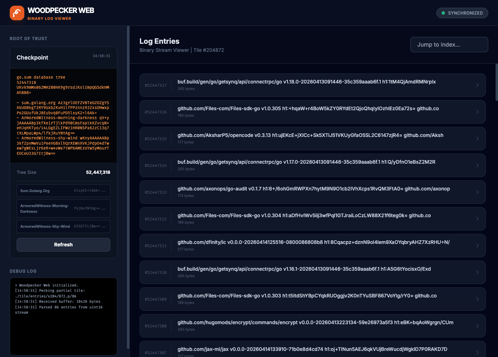

# Woodpecker Web

Woodpecker Web is a static HTML file that can be dropped at the root of a `tlog-tiles` log to provide a web viewer.

## Overview
Woodpecker Web is based on [Woodpecker](https://github.com/mhutchinson/woodpecker/), which is a CLI log inspector. While Woodpecker is a command-line tool for inspecting logs, Woodpecker Web is designed to be deployed by a log operator. Once deployed at the root of a log, it gives log viewing capabilities to anyone with a web browser. This makes it much easier to share visibility into a log without requiring users to install specialized CLI tools.

Note that this version of Woodpecker Web is designed to view a single log.

## How it Works
Woodpecker Web fetches the `./checkpoint` file to learn the current size of the log. It then fetches data tiles from the `./tile/entries/...` directory structure. This implementation follows the [tlog-tiles specification](https://c2sp.org/tlog-tiles), which is key to understanding how this tool operates and how the log data is structured.

The tiles are expected to be formatted as a stream of Length-Value Payloads (LVP) with 2-byte big-endian length prefixes.

## Features

### For Users
- **Checkpoint Inspector**: View the raw checkpoint and signatures.
- **Entry Browser**: Lists entries with their index and size.
- **Jump to Index**: Quickly navigate to a specific entry by index.
- **Detail Modal**: Inspect entries in both interpreted (text/JSON) and raw hex formats.

### For Log Operators
- **Customizable**: Contains a `LOG_CUSTOMIZER` object in the script to allow custom rendering of log entries to fit your specific log schema.

## Usage
Copy `index.html` to the root of your `tlog-tiles` directory (next to `./checkpoint`, `./tile`, etc.). Customize the leaf renderer if viewing the bytes as a string isn't what you want.
